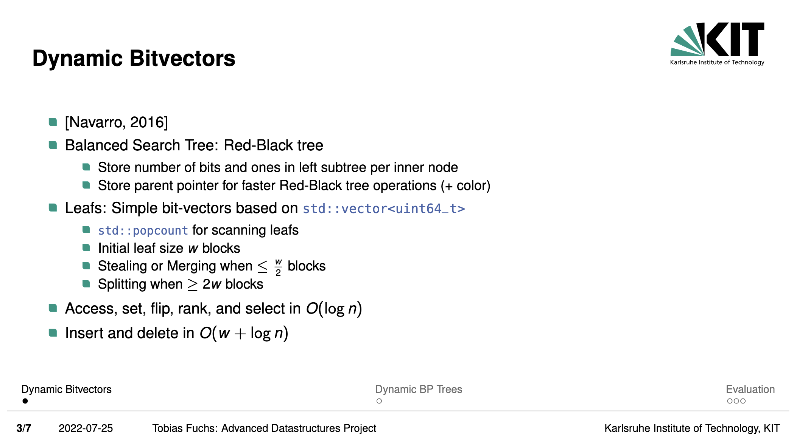

# Dynamic bitvectors using red-black search trees



This project was submitted for the *Advanced Data Structures* course at KIT during the Summer 2022 term.

* **Project Specifications:** Detailed task requirements and input structures can be found [here](./project.pdf).
* **Implementation Details:** A brief overview of the solution is available in [this presentation](./presentation.pdf).

## Build status

[](https://github.com/mathefuchs/advanced-datastructures-st22/actions/workflows/ci_gtest.yml) [](https://codecov.io/gh/mathefuchs/advanced-datastructures-st22)

## Instructions
* Clone repository and enter directory.
* Run build script, e.g.,
```
> sh build.sh
```
* The program `ads_programm_a` can be found under `build/advanced-datastructures-st22/ads_programm_a`.
